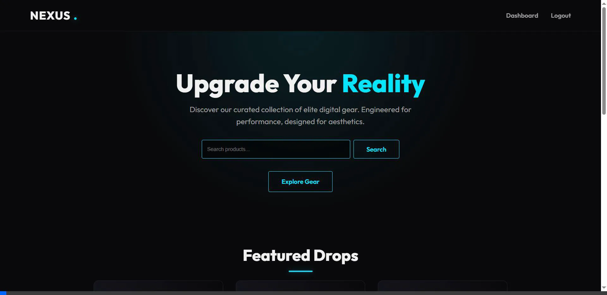
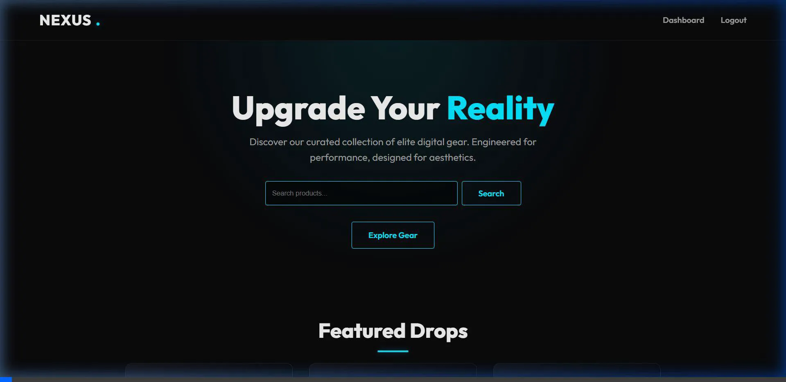
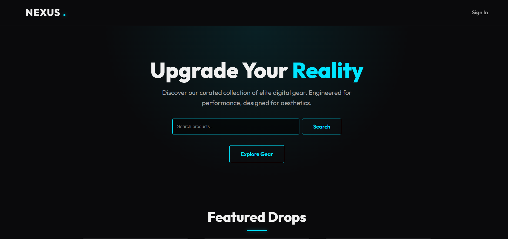
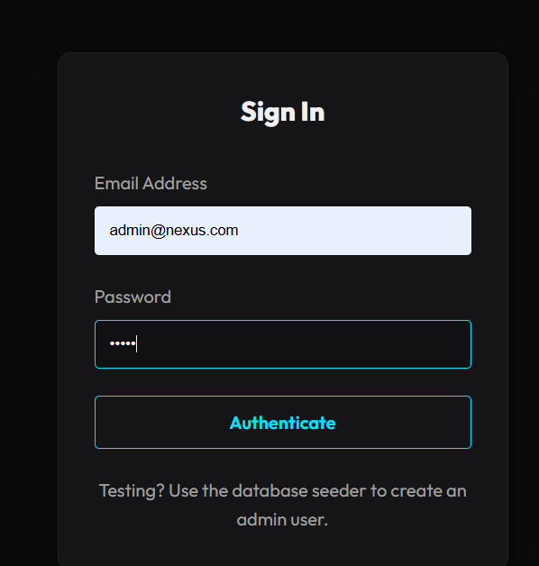
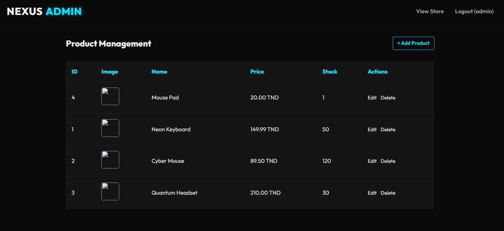
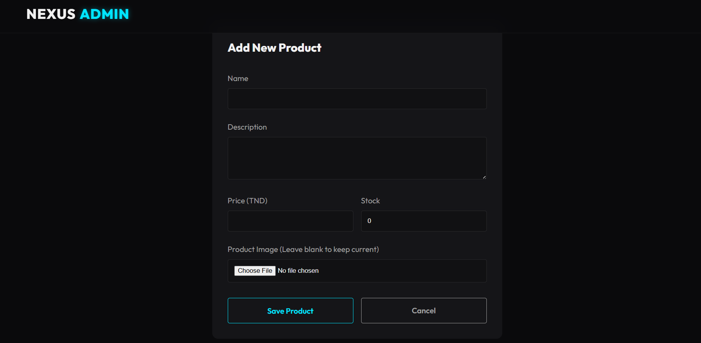

# Nexus E-Commerce Platform

📖 **[Lien vers le Rapport d'Utilisation de l'IA (AI Report)](./ai_report.md)**

**Nexus** is a premium, high-ticket e-commerce platform built strictly in **Vanilla PHP 8+** using the **MVC** design pattern, **POO**, and **PDO**. It features a custom Dark Mode/Neon design system without relying on external CSS frameworks.

## 🎥 Démonstrations par Fonctionnalité (User Stories)

Voici les démonstrations des principales fonctionnalités requises par le cahier des charges :

### 1. Recherche Multicritères (Recherche "Neon")
Permet aux clients de rechercher un produit par mot clé. La requête utilise `LIKE` avec PDO en toute sécurité.


### 2. Gestion du Panier d'Achat
Ajout dynamique de produits au panier et affichage sécurisé côté serveur.


### 3. Authentification et Espace Administrateur
Connexion sécurisée (`admin@nexus.com` / `admin`) permettant l'accès au tableau de bord pour la gestion du stock.






---

## 🛠️ Guide d'Installation Complet (Pour une autre machine)

Suivez ces étapes précises pour déployer et exécuter ce projet sur n'importe quel ordinateur équipé de Windows/Mac/Linux.

### Prérequis
1. Télécharger et installer **XAMPP** (ou WAMP/MAMP) : [https://www.apachefriends.org/fr/index.html](https://www.apachefriends.org/fr/index.html)
2. S'assurer que le port `80` (Apache) et `3306` (MySQL) sont libres.

### Étape 1 : Placement des Fichiers
1. Copiez le dossier entier `projet2` contenant tout le code source.
2. Allez dans le répertoire d'installation de XAMPP (généralement `C:\xampp`).
3. Ouvrez le dossier `htdocs`.
4. Collez le dossier `projet2` à l'intérieur. Le chemin complet doit être : `C:\xampp\htdocs\projet2`.

### Étape 2 : Démarrage des Services
1. Ouvrez le **XAMPP Control Panel**.
2. Cliquez sur le bouton **Start** à côté de **Apache**. Le nom deviendra vert.
3. Cliquez sur le bouton **Start** à côté de **MySQL**. Le nom deviendra vert.

### Étape 3 : Configuration de la Base de Données
1. Ouvrez votre navigateur et allez sur : [http://localhost/phpmyadmin/](http://localhost/phpmyadmin/)
2. Cliquez sur l'onglet **SQL** dans la barre de menu supérieure.
3. Copiez le code SQL ci-dessous (le Dump complet) et collez-le dans la zone de texte.
4. Cliquez sur le bouton **Exécuter** (ou Go) en bas à droite.
   *(Ceci va créer la base de données `ecommerce_db`, les 4 tables, et insérer les données de test !)*

### Étape 4 : Lancement de l'Application
1. Dans votre navigateur, allez sur l'URL suivante pour lancer le Front Controller :
   👉 **[http://localhost/projet2/Public/index.php](http://localhost/projet2/Public/index.php)**
2. Le site devrait s'afficher correctement avec le thème sombre et les produits !

### Données de Test (Comptes)
Pour tester l'espace administrateur, cliquez sur **Sign In** en haut à droite et utilisez :
* **Email :** `admin@nexus.com`
* **Mot de passe :** `admin`

---

## 💾 Dump SQL Complet (À copier dans phpMyAdmin)

```sql
-- Création de la base de données
CREATE DATABASE IF NOT EXISTS ecommerce_db CHARACTER SET utf8mb4 COLLATE utf8mb4_unicode_ci;
USE ecommerce_db;

-- Table des Utilisateurs
CREATE TABLE IF NOT EXISTS users (
    id INT AUTO_INCREMENT PRIMARY KEY,
    username VARCHAR(50) NOT NULL UNIQUE,
    email VARCHAR(100) NOT NULL UNIQUE,
    password_hash VARCHAR(255) NOT NULL,
    role ENUM('customer', 'admin') DEFAULT 'customer',
    created_at TIMESTAMP DEFAULT CURRENT_TIMESTAMP,
    updated_at TIMESTAMP DEFAULT CURRENT_TIMESTAMP ON UPDATE CURRENT_TIMESTAMP
) ENGINE=InnoDB DEFAULT CHARSET=utf8mb4;

-- Table des Produits
CREATE TABLE IF NOT EXISTS products (
    id INT AUTO_INCREMENT PRIMARY KEY,
    name VARCHAR(255) NOT NULL,
    description TEXT,
    price DECIMAL(10, 2) NOT NULL,
    image_url VARCHAR(255) DEFAULT NULL,
    stock INT DEFAULT 0,
    created_at TIMESTAMP DEFAULT CURRENT_TIMESTAMP,
    updated_at TIMESTAMP DEFAULT CURRENT_TIMESTAMP ON UPDATE CURRENT_TIMESTAMP
) ENGINE=InnoDB DEFAULT CHARSET=utf8mb4;

-- Table des Commandes
CREATE TABLE IF NOT EXISTS orders (
    id INT AUTO_INCREMENT PRIMARY KEY,
    user_id INT NOT NULL,
    total_amount DECIMAL(10, 2) NOT NULL,
    status ENUM('pending', 'completed', 'cancelled') DEFAULT 'pending',
    created_at TIMESTAMP DEFAULT CURRENT_TIMESTAMP,
    updated_at TIMESTAMP DEFAULT CURRENT_TIMESTAMP ON UPDATE CURRENT_TIMESTAMP,
    FOREIGN KEY (user_id) REFERENCES users(id) ON DELETE CASCADE
) ENGINE=InnoDB DEFAULT CHARSET=utf8mb4;

-- Table de l'historique du Panier (Liaison Commandes/Produits)
CREATE TABLE IF NOT EXISTS order_items (
    id INT AUTO_INCREMENT PRIMARY KEY,
    order_id INT NOT NULL,
    product_id INT NOT NULL,
    quantity INT NOT NULL DEFAULT 1,
    unit_price DECIMAL(10, 2) NOT NULL,
    FOREIGN KEY (order_id) REFERENCES orders(id) ON DELETE CASCADE,
    FOREIGN KEY (product_id) REFERENCES products(id) ON DELETE RESTRICT
) ENGINE=InnoDB DEFAULT CHARSET=utf8mb4;

-- Insertion du Compte Administrateur (Mot de passe: admin)
INSERT INTO users (username, email, password_hash, role) VALUES 
('admin', 'admin@nexus.com', '$2y$10$xrKM8eNu9PRgZOc4aJLvg.Q0ySmbhkm3Oe.kD3kRR7y/D7U2Y2pAy', 'admin');

-- Insertion des Produits de Démonstration
INSERT INTO products (name, description, price, image_url, stock) VALUES 
('Neon Keyboard', 'High-performance mechanical keyboard with RGB neon accents.', 149.99, '/assets/images/neon-keyboard.jpg', 50),
('Cyber Mouse', 'Precision laser mouse optimized for high-speed gaming.', 89.50, '/assets/images/cyber-mouse.jpg', 120),
('Quantum Headset', 'Immersive 7.1 surround sound with noise cancellation.', 210.00, '/assets/images/quantum-headset.jpg', 30);
```
